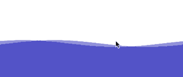
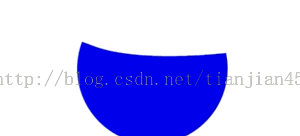

# 自定义view实现水波纹效果

来源:[CSDN](http://blog.csdn.net/tianjian4592/article/details/44222565)

在实际的开发中，很多时候还会遇到相对比较复杂的需求，比如产品妹纸或UI妹纸在哪看了个让人兴奋的效果，兴致高昂的来找你，看了之后目的很明确，当然就是希望你能给她；

在这样的关键时候，身子板就一定得硬了，可千万别说不行，爷们儿怎么能说不行呢；

好了，为了让大家都能给妹纸们想要的，后面会逐渐分享一些比较比较不错的效果，目的只有一个，通过自定义view实现我们所能实现的动效；

今天主要分享水波纹效果：
* 1.标准正余弦水波纹；
* 2.非标准圆形液柱水波纹；
虽说都是水波纹，但两者在实现上差异是比较大的，一个通过正余弦函数模拟水波纹效果，另外一个会运用到图像的混合模式（PorterDuffXfermode）；

先看效果：

  

自定义View根据实际情况可以选择继承自View、TextView、ImageView或其他，我们先只需要了解如何利用android给我们提供好的利刃去满足UI妹纸；

这次的实现我们都选择继承view，在实现的过程中我们需要关注如下几个方法：

* 1.onMeasure():最先回调，用于控件的测量;
* 2.onSizeChanged():在onMeasure后面回调，可以拿到view的宽高等数据，在横竖屏切换时也会回调;
* 3.onDraw()：真正的绘制部分，绘制的代码都写到这里面;

既然如此，我们先复写这三个方法，然后来实现如上两个效果；

## 一：标准正余弦水波纹
这种水波纹可以用具体函数模拟出具体的轨迹，所以思路基本如下：

* 1.确定水波函数方程
* 2.根据函数方程得出每一个波纹上点的坐标；
* 3.将水波进行平移，即将水波上的点不断的移动；
* 4.不断的重新绘制，生成动态水波纹；

有了上面的思路，我们一步一步进行实现：

正余弦函数方程为：

`y = Asin(wx+b)+h`，这个公式里：w影响周期，A影响振幅，h影响y位置，b为初相；

根据上面的方程选取自己觉得中意的波纹效果，确定对应参数的取值；

然后根据确定好的方程得出所有的方程上y的数值，并将所有y值保存在数组里：

```
// 将周期定为view总宽度  
mCycleFactorW = (float) (2 * Math.PI / mTotalWidth);  
  
// 根据view总宽度得出所有对应的y值  
for (int i = 0; i < mTotalWidth; i++) {  
    mYPositions[i] = (float) (STRETCH_FACTOR_A * Math.sin(mCycleFactorW * i) + OFFSET_Y);  
}  
```

根据得出的所有y值，则可以在onDraw中通过如下代码绘制两条静态波纹：

```
for (int i = 0; i < mTotalWidth; i++) {  
  
	// 减400只是为了控制波纹绘制的y的在屏幕的位置，
	// 大家可以改成一个变量，然后动态改变这个变量，从而形成波纹上升下降效果  
    // 绘制第一条水波纹  
	canvas.drawLine(i, mTotalHeight - mResetOneYPositions[i] - 400, i,  
    		mTotalHeight,  
    		mWavePaint);  

	// 绘制第二条水波纹  
    canvas.drawLine(i, mTotalHeight - mResetTwoYPositions[i] - 400, i,  
    		mTotalHeight,  
			mWavePaint);  
}  
```

这种方式类似于数学里面的细分法，一条波纹，如果横向以一个像素点为单位进行细分，则形成view总宽度条直线，并且每条直线的起点和终点我们都能知道，在此基础上我们只需要循环绘制出所有细分出来的直线（直线都是纵向的），则形成了一条静态的水波纹；

接下来我们让水波纹动起来，之前用了一个数组保存了所有的y值点，有两条水波纹，再利用两个同样大小的数组来保存两条波纹的y值数据，并不断的去改变这两个数组中的数据：

```
private void resetPositonY() {  
    // mXOneOffset代表当前第一条水波纹要移动的距离  
    int yOneInterval = mYPositions.length - mXOneOffset;  
    // 使用System.arraycopy方式重新填充第一条波纹的数据  
    System.arraycopy(mYPositions, mXOneOffset, mResetOneYPositions, 0, yOneInterval);  
    System.arraycopy(mYPositions, 0, mResetOneYPositions, yOneInterval, mXOneOffset);  
  
    int yTwoInterval = mYPositions.length - mXTwoOffset;  
    System.arraycopy(mYPositions, mXTwoOffset, mResetTwoYPositions, 0,  
            yTwoInterval);  
    System.arraycopy(mYPositions, 0, mResetTwoYPositions, yTwoInterval, mXTwoOffset);  
}  
```

如此下来只要不断的改变这两个数组的数据，然后不断刷新，即可生成动态水波纹了；

刷新可以调用invalidate()或postInvalidate()，区别在于后者可以在子线程中更新UI

整体代码如下：

```
public class DynamicWave extends View {  
  
    // 波纹颜色  
    private static final int WAVE_PAINT_COLOR = 0x880000aa;  
    // y = Asin(wx+b)+h  
    private static final float STRETCH_FACTOR_A = 20;  
    private static final int OFFSET_Y = 0;  
    // 第一条水波移动速度  
    private static final int TRANSLATE_X_SPEED_ONE = 7;  
    // 第二条水波移动速度  
    private static final int TRANSLATE_X_SPEED_TWO = 5;  
    private float mCycleFactorW;  
  
    private int mTotalWidth, mTotalHeight;  
    private float[] mYPositions;  
    private float[] mResetOneYPositions;  
    private float[] mResetTwoYPositions;  
    private int mXOffsetSpeedOne;  
    private int mXOffsetSpeedTwo;  
    private int mXOneOffset;  
    private int mXTwoOffset;  
  
    private Paint mWavePaint;  
    private DrawFilter mDrawFilter;  
  
    public DynamicWave(Context context, AttributeSet attrs) {  
        super(context, attrs);  
        // 将dp转化为px，用于控制不同分辨率上移动速度基本一致  
        mXOffsetSpeedOne = UIUtils.dipToPx(context, TRANSLATE_X_SPEED_ONE);  
        mXOffsetSpeedTwo = UIUtils.dipToPx(context, TRANSLATE_X_SPEED_TWO);  
  
        // 初始绘制波纹的画笔  
        mWavePaint = new Paint();  
        // 去除画笔锯齿  
        mWavePaint.setAntiAlias(true);  
        // 设置风格为实线  
        mWavePaint.setStyle(Style.FILL);  
        // 设置画笔颜色  
        mWavePaint.setColor(WAVE_PAINT_COLOR);  
        mDrawFilter = new PaintFlagsDrawFilter(0, Paint.ANTI_ALIAS_FLAG | Paint.FILTER_BITMAP_FLAG);  
    }  
  
    @Override  
    protected void onDraw(Canvas canvas) {  
        super.onDraw(canvas);  
        // 从canvas层面去除绘制时锯齿  
        canvas.setDrawFilter(mDrawFilter);  
        resetPositonY();  
        for (int i = 0; i < mTotalWidth; i++) {  
  
            // 减400只是为了控制波纹绘制的y的在屏幕的位置，大家可以改成一个变量，然后动态改变这个变量，从而形成波纹上升下降效果  
            // 绘制第一条水波纹  
            canvas.drawLine(i, mTotalHeight - mResetOneYPositions[i] - 400, i,  
                    mTotalHeight,  
                    mWavePaint);  
  
            // 绘制第二条水波纹  
            canvas.drawLine(i, mTotalHeight - mResetTwoYPositions[i] - 400, i,  
                    mTotalHeight,  
                    mWavePaint);  
        }  
  
        // 改变两条波纹的移动点  
        mXOneOffset += mXOffsetSpeedOne;  
        mXTwoOffset += mXOffsetSpeedTwo;  
  
        // 如果已经移动到结尾处，则重头记录  
        if (mXOneOffset >= mTotalWidth) {  
            mXOneOffset = 0;  
        }  
        if (mXTwoOffset > mTotalWidth) {  
            mXTwoOffset = 0;  
        }  
  
        // 引发view重绘，一般可以考虑延迟20-30ms重绘，空出时间片  
        postInvalidate();  
    }  
  
    private void resetPositonY() {  
        // mXOneOffset代表当前第一条水波纹要移动的距离  
        int yOneInterval = mYPositions.length - mXOneOffset;  
        // 使用System.arraycopy方式重新填充第一条波纹的数据  
        System.arraycopy(mYPositions, mXOneOffset, mResetOneYPositions, 0, yOneInterval);  
        System.arraycopy(mYPositions, 0, mResetOneYPositions, yOneInterval, mXOneOffset);  
  
        int yTwoInterval = mYPositions.length - mXTwoOffset;  
        System.arraycopy(mYPositions, mXTwoOffset, mResetTwoYPositions, 0,  
                yTwoInterval);  
        System.arraycopy(mYPositions, 0, mResetTwoYPositions, yTwoInterval, mXTwoOffset);  
    }  
  
    @Override  
    protected void onSizeChanged(int w, int h, int oldw, int oldh) {  
        super.onSizeChanged(w, h, oldw, oldh);  
        // 记录下view的宽高  
        mTotalWidth = w;  
        mTotalHeight = h;  
        // 用于保存原始波纹的y值  
        mYPositions = new float[mTotalWidth];  
        // 用于保存波纹一的y值  
        mResetOneYPositions = new float[mTotalWidth];  
        // 用于保存波纹二的y值  
        mResetTwoYPositions = new float[mTotalWidth];  
  
        // 将周期定为view总宽度  
        mCycleFactorW = (float) (2 * Math.PI / mTotalWidth);  
  
        // 根据view总宽度得出所有对应的y值  
        for (int i = 0; i < mTotalWidth; i++) {  
            mYPositions[i] = (float) (STRETCH_FACTOR_A * Math.sin(mCycleFactorW * i) + OFFSET_Y);  
        }  
    }  
```

## 二：非标准圆形液柱水波纹

前面的波形使用函数模拟，这个我们换种方式，采用图进行实现，先用PS整张不像波纹的波纹图；


为了衔接紧密，首尾都比较平，并高度一致；

思路：

* 1.使用一个圆形图作为遮罩过滤波形图；
* 2.平移波纹图，即不断改变绘制的波纹图的区域，即srcRect；
* 3.当一个周期绘制完，则从波纹图的最前面重新计算；

首先初始化bitmap：

```
private void initBitmap() {  
        mSrcBitmap = ((BitmapDrawable) getResources()
        		.getDrawable(R.drawable.wave_2000))  
                .getBitmap();
                  
        mMaskBitmap = ((BitmapDrawable) getResources()
        		.getDrawable(R.drawable.circle_500))  
                .getBitmap();  
}  

```

使用drawable获取的方式，全局只会生成一份，并且系统会进行管理，而BitmapFactory.decode()出来的则decode多少次生成多少张，务必自己进行recycle；

然后绘制波浪和遮罩图，绘制时设置对应的混合模式：

```
/*  
 * 将绘制操作保存到新的图层  
 */  
int sc = canvas.saveLayer(0, 0, mTotalWidth, mTotalHeight, null, Canvas.ALL_SAVE_FLAG);  
  
// 设定要绘制的波纹部分  
mSrcRect.set(mCurrentPosition, 0, mCurrentPosition + mCenterX, mTotalHeight);  
// 绘制波纹部分  
canvas.drawBitmap(mSrcBitmap, mSrcRect, mDestRect, mBitmapPaint);  
  
// 设置图像的混合模式  
mBitmapPaint.setXfermode(mPorterDuffXfermode);  
// 绘制遮罩圆  
canvas.drawBitmap(mMaskBitmap, mMaskSrcRect, mMaskDestRect,  
        mBitmapPaint);  
mBitmapPaint.setXfermode(null);  
canvas.restoreToCount(sc);  

```

为了形成动态的波浪效果，单开一个线程动态更新要绘制的波浪的位置：

```
new Thread() {  
    public void run() {  
        while (true) {  
            // 不断改变绘制的波浪的位置  
            mCurrentPosition += mSpeed;  
            if (mCurrentPosition >= mSrcBitmap.getWidth()) {  
                mCurrentPosition = 0;  
            }  
            try {  
                // 为了保证效果的同时，尽可能将cpu空出来，供其他部分使用  
                Thread.sleep(30);  
            } catch (InterruptedException e) {  
            }  
  
            postInvalidate();  
        }  
  
    };  
}.start();  
```

主要过程就以上这些，全部代码如下：

```
public class PorterDuffXfermodeView extends View {  
  
    private static final int WAVE_TRANS_SPEED = 4;  
  
    private Paint mBitmapPaint, mPicPaint;  
    private int mTotalWidth, mTotalHeight;  
    private int mCenterX, mCenterY;  
    private int mSpeed;  
  
    private Bitmap mSrcBitmap;  
    private Rect mSrcRect, mDestRect;  
  
    private PorterDuffXfermode mPorterDuffXfermode;  
    private Bitmap mMaskBitmap;  
    private Rect mMaskSrcRect, mMaskDestRect;  
    private PaintFlagsDrawFilter mDrawFilter;  
  
    private int mCurrentPosition;  
  
    public PorterDuffXfermodeView(Context context, AttributeSet attrs) {  
        super(context, attrs);  
        initPaint();  
        initBitmap();  
        mPorterDuffXfermode = new PorterDuffXfermode(PorterDuff.Mode.DST_IN);  
        mSpeed = UIUtils.dipToPx(mContext, WAVE_TRANS_SPEED);  
        mDrawFilter = new PaintFlagsDrawFilter(Paint.ANTI_ALIAS_FLAG, Paint.DITHER_FLAG);  
        new Thread() {  
            public void run() {  
                while (true) {  
                    // 不断改变绘制的波浪的位置  
                    mCurrentPosition += mSpeed;  
                    if (mCurrentPosition >= mSrcBitmap.getWidth()) {  
                        mCurrentPosition = 0;  
                    }  
                    try {  
                        // 为了保证效果的同时，尽可能将cpu空出来，供其他部分使用  
                        Thread.sleep(30);  
                    } catch (InterruptedException e) {  
                    }  
  
                    postInvalidate();  
                }  
  
            };  
        }.start();  
    }  
  
    @Override  
    protected void onDraw(Canvas canvas) {  
        super.onDraw(canvas);  
  
        // 从canvas层面去除锯齿  
        canvas.setDrawFilter(mDrawFilter);  
        canvas.drawColor(Color.TRANSPARENT);  
  
        /*  
         * 将绘制操作保存到新的图层  
         */  
        int sc = canvas.saveLayer(0, 0, mTotalWidth, mTotalHeight, null, Canvas.ALL_SAVE_FLAG);  
  
        // 设定要绘制的波纹部分  
        mSrcRect.set(mCurrentPosition, 0, mCurrentPosition + mCenterX, mTotalHeight);  
        // 绘制波纹部分  
        canvas.drawBitmap(mSrcBitmap, mSrcRect, mDestRect, mBitmapPaint);  
  
        // 设置图像的混合模式  
        mBitmapPaint.setXfermode(mPorterDuffXfermode);  
        // 绘制遮罩圆  
        canvas.drawBitmap(mMaskBitmap, mMaskSrcRect, mMaskDestRect,  
                mBitmapPaint);  
        mBitmapPaint.setXfermode(null);  
        canvas.restoreToCount(sc);  
    }  
  
    // 初始化bitmap  
    private void initBitmap() {  
        mSrcBitmap = ((BitmapDrawable) getResources().getDrawable(R.drawable.wave_2000))  
                .getBitmap();  
        mMaskBitmap = ((BitmapDrawable) getResources().getDrawable(  
                R.drawable.circle_500))  
                .getBitmap();  
    }  
  
    // 初始化画笔paint  
    private void initPaint() {  
  
        mBitmapPaint = new Paint();  
        // 防抖动  
        mBitmapPaint.setDither(true);  
        // 开启图像过滤  
        mBitmapPaint.setFilterBitmap(true);  
  
        mPicPaint = new Paint(Paint.ANTI_ALIAS_FLAG);  
        mPicPaint.setDither(true);  
        mPicPaint.setColor(Color.RED);  
    }  
  
    @Override  
    protected void onSizeChanged(int w, int h, int oldw, int oldh) {  
        super.onSizeChanged(w, h, oldw, oldh);  
        mTotalWidth = w;  
        mTotalHeight = h;  
        mCenterX = mTotalWidth / 2;  
        mCenterY = mTotalHeight / 2;  
  
        mSrcRect = new Rect();  
        mDestRect = new Rect(0, 0, mTotalWidth, mTotalHeight);  
  
        int maskWidth = mMaskBitmap.getWidth();  
        int maskHeight = mMaskBitmap.getHeight();  
        mMaskSrcRect = new Rect(0, 0, maskWidth, maskHeight);  
        mMaskDestRect = new Rect(0, 0, mTotalWidth, mTotalHeight);  
    }  
  
}  

```

[源码CSDN下载地址](http://download.csdn.net/detail/tianjian4592/8571345)

-------

评论内容：

* 评论1

多谢博主的文章，学到了很多。博主实现的非标准圆形液柱水波纹中存在一个问题，就是线程开启后没有被关闭掉，在程序退到后台后线程仍然会处于运行状态，这点在实际使用时需要解决掉(设一个boolean变量flag，当要结束的时候改变flag的值，根据flag判断时候退出thread)

还有个问题就是正弦水波纹效果，每次在ondraw的时候其实可以不用重新都拷贝2个数组，直接通过mYPositions利用相应的偏移量就可以获得两个波浪的数据，说简单点就是可以不使用

mResetOneYPositions和mResetTwoYPositions直接通过mYPositions获取两个波浪数据，从而节约每次拷贝的时间提高性能。总体来说博主的文章还是非常棒的

* 评论2

AvoidXfermode和PixelXorXfermode不支持硬件加速，PorterDuffXfermode中有几个特殊的会有影响：PorterDuff.Mode.DARKEN 当针对framebuffer时和SRC_OVER是等效的；PorterDuff.Mode.LIGHTEN 当针对framebuffer时和SRC_OVER是等效的；PorterDuff.Mode.OVERLAY 当针对framebuffer时和SRC_OVER是等效的；

SRC_IN 与 DST_IN在硬件加速上也会存在bug 你可以试下先画 图形再画Bitmap使用SRC_IN，与先画Bitmap再画图形使用DST_IN，在是否开启硬件加速的情况下，显示效果是不同的