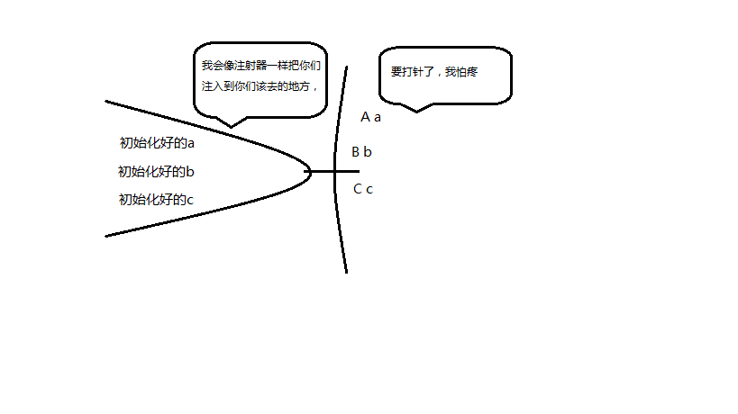
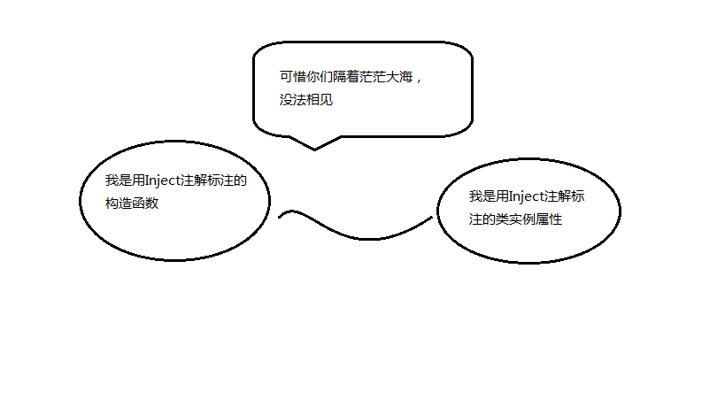
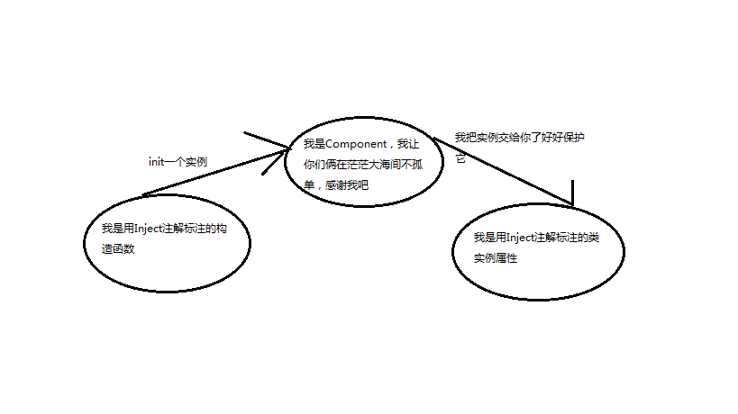
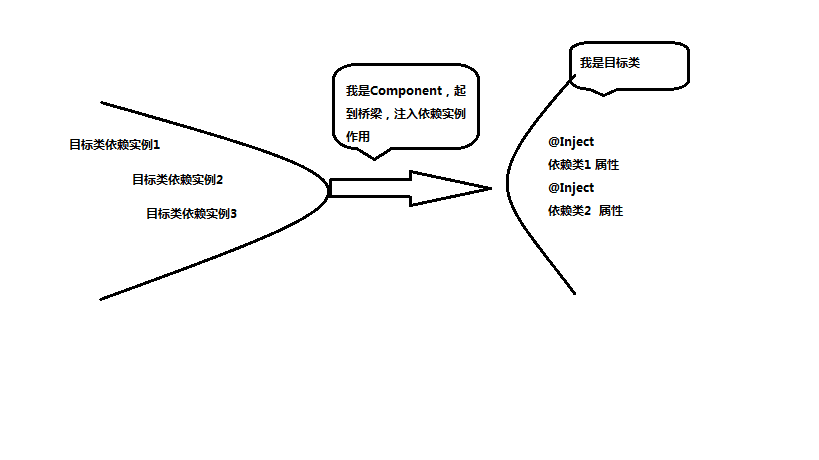
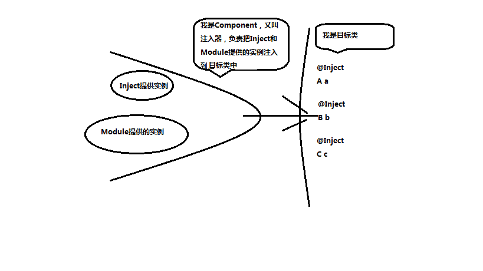

# dagger2 让你爱不释手：基础依赖注入框架篇

来源:[伯乐在线-http://www.jobbole.com/members/niugxl87](http://android.jobbole.com/82694/)

## 前言

dagger2的大名我想大家都已经很熟了，它是解决Android或java中依赖注入的一个类库（DI类库）。当我看到一些开源的项目在使用dagger2时，我也有种匆匆欲动的感觉，因此就立马想一探它的究竟，到底能给我带来怎样的好处。在学习使用dagger2的过程中，我遇到了以下的一些困惑：

* dagger2中的Inject,Component,Module,Provides等等都是什么东东，有什么作用?
* dagger2到底能带来哪些好处？
* 怎样把dagger2应用到具体项目中？

在具体学习dagger2的时候，看了好多博客，看的时候感觉挺简单的，但是在真正使用到项目中时候，脑袋就懵了，无从下手，Component应该怎么用，能放些什么方法? Module应该放些啥内容？Scope怎么起到作用域控制？…..各种疑问就横空而出。**所以也许会有正在学习或即将要使用dagger2的同学在使用过程中遇到和我一样的困惑**，因此我决定把我对dagger2的理解、使用经验分享给大家，希望能对大家有帮助。

我会分几节给讲解dagger2。

## 本节内容

Inject，Component，Module，Provides它们是什么？怎么去理解它们？各自有什么作用？主要从抽象的概念讲解，不会涉及到具体代码的剖析。

## 提前科普知识点

在讲解之前，我希望大家对以下知识点有所了解（知道的同学可以跳过）

* **依赖注入（Dependency Injection简称ID）**
* **java中注解(Annotation)**

**依赖注入**：就是目标类（目标类需要进行依赖初始化的类，下面都会用目标类一词来指代）中所**依赖的其他的类**的初始化过程，不是通过手动编码的方式创建，而是通过**技术手段**可以把**其他的类的已经初始化好的实例**自动注入到目标类中。



若您还是对依赖注入不了解,[点击我可以让您了解更多](http://baike.baidu.com/link?url=QB0xjWcya3HWr4p9VwZ6hxjcO-fybEbuLv6nBvHDbg99-HyLzstlGayZfIu4Swrw8QSyTmUdz3EVPRaOLdrGGyEXoasaIQra3wfojaX1RJgZ6Nl8mazfQrJYuwXA1G5TT9CM3cLqVdhLk-lG0Bo6SWo4wT-yaTv62_7GuOo-VcaGwpnohMlG0GIcnizbKVJQ)

dagger2就是实现**依赖注入**的一种**技术手段**。

其次java注解的概念用法我们就不讲了，dagger2中核心点就是java注解，[点击我可以了解更多java注解知识](http://baike.baidu.com/link?url=aTMlLy_LOV3j6d9aszLbSOwUajGSL_CI1LagJ8bh--PxtOmrCI5vSwewTPCxLcVe07Q4BNoxqFX3TpsJ5B9yPq)

## 正式开始

以下的内容我会尝试着去模仿**dagger2的作者是怎样一步步完成dagger2这样伟大的依赖注入类库的场景来讲解**（首先这个场景是我意淫的，大家勿喷，模仿该场景主要目的是为了能**由简到难**一步步更深入的了解dagger2）

### Inject是什么鬼

先看一段代码：

```
 class A{
       B b = new B(...);
       C c = new C();
       D d = new D(new E());
       F f = new F(.....);
 }
```

上面的代码完全没任何问题，但是总感觉创建对象的这些代码基本都是重复的体力劳动，那何尝不想个办法，把这些重复的体力劳动用一种自动化的、更省力的方法解决掉，这样就可以让开发的效率提高，可以把精力集中在重要的业务上了。

我们可以用**注解(Annotation)来标注目标类中所依赖的其他类，同样用注解来标注所依赖的其他类的构造函数**，那注解的名字就叫Inject

```
   class A{
        @Inject
        B b;
   }

   class B{
       @Inject
       B(){
       }
   }
```

这样我们就可以让目标类中所依赖的其他类与其他类的构造函数之间有了一种无形的联系。但是要想使它们之间产生直接的关系，还得需要一个桥梁来把它们之间连接起来。那这个桥梁就是Component了。



### Component又是什么鬼

Component也是一个注解类，一个类要想是Component，必须用Component注解来标注该类，并且该类是接口或抽象类。我们不讨论具体类的代码，我想从抽象概念的角度来讨论Component。上文中提到Component在目标类中所依赖的其他类与其他类的构造函数之间可以起到一个桥梁的作用。

那我们看看这桥梁是怎么工作的：

> Component需要引用到目标类的实例，Component会查找目标类中用Inject注解标注的属性，查找到相应的属性后会接着查找该属性对应的用Inject标注的构造函数（这时候就发生联系了），剩下的工作就是初始化该属性的实例并把实例进行赋值。因此我们也可以给Component叫另外一个名字注入器（Injector）



### 小结下

目标类想要初始化自己依赖的其他类：

* 用Inject注解标注目标类中其他类
* 用Inject注解标注其他类的构造函数
* 若其他类还依赖于其他的类，则重复进行上面2个步骤
* 调用Component（注入器）的injectXXX（Object）方法开始注入（injectXXX方法名字是官方推荐的名字,以inject开始）

Component现在是一个注入器，就像注射器一样，Component会把目标类依赖的实例注入到目标类中，来初始化目标类中的依赖。

## 为啥又造出个Module

现在有个新问题：项目中使用到了第三方的类库，第三方类库又不能修改，所以根本不可能把Inject注解加入这些类中，这时我们的Inject就失效了。

那我们可以封装第三方的类库，封装的代码怎么管理呢，总不能让这些封装的代码散落在项目中的任何地方，总得有个好的管理机制，那Module就可以担当此任。

可以把封装第三方类库的代码放入Module中，像下面的例子：

```
    @Module
    public class ModuleClass{
          //A是第三方类库中的一个类
          A provideA(){
               return A();
          }
    }
```

，**Module其实是一个简单工厂模式，Module里面的方法基本都是创建类实例的方法**。接下来问题来了，因为Component是注入器（Injector），我们怎么能让Component与Module有联系呢？

## Component的新职责

Component是注入器，它一端连接目标类，另一端连接目标类依赖实例，它把目标类依赖实例注入到目标类中。上文中的Module是一个提供类实例的类，所以Module应该是属于Component的实例端的（连接各种目标类依赖实例的端），Component的新职责就是管理好Module，Component中的modules属性可以把Module加入Component，modules可以加入多个Module。



那接下来的问题是怎么把Module中的各种创建类的实例方法与目标类中的用Inject注解标注的依赖产生关联，那Provides注解就该登场了。

## Provides最终解决第三方类库依赖注入问题

Module中的创建类实例方法用Provides进行标注，Component在搜索到目标类中用Inject注解标注的属性后，Component就会去Module中去查找用Provides标注的对应的创建类实例方法，这样就可以解决第三方类库用dagger2实现依赖注入了。

## 总结

Inject，Component，Module，Provides是dagger2中的最基础最核心的知识点。奠定了dagger2的整个依赖注入框架。

* Inject主要是用来标注目标类的依赖和依赖的构造函数
* Component它是一个桥梁，一端是目标类，另一端是目标类所依赖类的实例，它也是注入器（Injector）负责把目标类所依赖类的实例注入到目标类中，同时它也管理Module。
* Module和Provides是为解决第三方类库而生的，Module是一个简单工厂模式，Module可以包含创建类实例的方法，这些方法用Provides来标注



dagger2中Scope（作用域），Qualifier（限定符），Singleton（单例），SubComponent等都是对dagger2中整个注入依赖注入框架进行的补充，我们后面会继续讲解，敬请期待……

希望能帮您更好的理解dagger2。

欢迎各位多多交流，转载请标明出处。