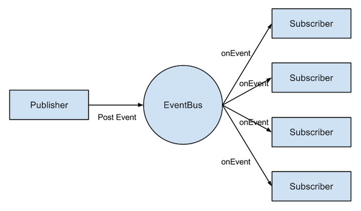
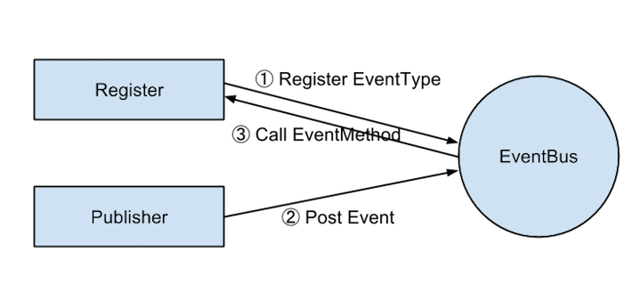

# Android -- EventBus解析

来源：[cnblogs](http://www.cnblogs.com/yydcdut/p/4651208.html)

## EventBus

EventBus 是一个 Android 事件发布/订阅框架，通过解耦发布者和订阅者简化 Android 事件传递。传统的事件传递方式包括：Handler、BroadCastReceiver、Interface 回调，相比之下 EventBus 的优点是代码简洁，使用简单，并将事件发布和订阅充分解耦。

**事件(Event)：**又可称为消息。其实就是一个对象，可以是网络请求返回的字符串，也可以是某个开关状态等等。事件类型(EventType)指事件所属的 Class。事件分为一般事件和 Sticky 事件，相对于一般事件，Sticky 事件不同之处在于，当事件发布后，再有订阅者开始订阅该类型事件，依然能收到该类型事件最近一个 Sticky 事件。

**订阅者(Subscriber)：**订阅某种事件类型的对象。当有发布者发布这类事件后，EventBus 会执行订阅者的 onEvent 函数，这个函数叫事件响应函数。订阅者通过 register 接口订阅某个事件类型，unregister 接口退订。订阅者存在优先级，优先级高的订阅者可以取消事件继续向优先级低的订阅者分发，默认所有订阅者优先级都为 0。

**发布者(Publisher)：**发布某事件的对象，通过 post 接口发布事件。

## 类关系


## 流程



EventBus 负责存储订阅者、事件相关信息，订阅者和发布者都只和 EventBus 关联。



订阅者首先调用 EventBus 的 register 接口订阅某种类型的事件，当发布者通过 post 接口发布该类型的事件时，EventBus 执行调用者的事件响应函数。

## 解析

EventBus 类负责所有对外暴露的 API，其中的`register()`、`post()`、`unregister()`函数配合上自定义的 EventType 及事件响应函数即可完成核心功能。

EventBus 默认可通过静态函数`getDefault()`获取单例，当然有需要也可以通过 EventBusBuilder 或 构造函数新建一个 EventBus，每个新建的 EventBus 发布和订阅事件都是相互隔离的，即一个 EventBus 对象中的发布者发布事件，另一个 EventBus 对象中的订阅者不会收到该订阅。

```
EventBus.getDefault().register(this);
```

register()方法解析：

```
    public void register(Object subscriber) {
        Class<?> subscriberClass = subscriber.getClass();
        // @Subscribe in anonymous classes is invisible to annotation processing, always fall back to reflection
        boolean forceReflection = subscriberClass.isAnonymousClass();
        List<SubscriberMethod> subscriberMethods =
                subscriberMethodFinder.findSubscriberMethods(subscriberClass, forceReflection);//主要查找又什么方法是在这个函数里面
        for (SubscriberMethod subscriberMethod : subscriberMethods) {
            subscribe(subscriber, subscriberMethod);
        }
    }
```

通过一个`findSubscriberMethods`方法找到了一个订阅者中的所有订阅方法，返回一个 List。

```
List<SubscriberMethod> findSubscriberMethods(Class<?> subscriberClass, boolean forceReflection) {
        //类名
        String key = subscriberClass.getName();
        List<SubscriberMethod> subscriberMethods;
        synchronized (METHOD_CACHE) {
            //判断是否有缓存，有缓存直接返回缓存  
            subscriberMethods = METHOD_CACHE.get(key);
        }
        //第一次进来subscriberMethods肯定是Null
        if (subscriberMethods != null) {
            return subscriberMethods;
        }
        //INDEX是GeneratedSubscriberIndex
        if (INDEX != null && !forceReflection) {
            subscriberMethods = findSubscriberMethodsWithIndex(subscriberClass);//后面再来看这个函数
            if (subscriberMethods.isEmpty()) {
                subscriberMethods = findSubscriberMethodsWithReflection(subscriberClass);//通过反射来找到方法
            }
        } else {
            subscriberMethods = findSubscriberMethodsWithReflection(subscriberClass);//通过反射来找到方法
        }
        if (subscriberMethods.isEmpty()) {
            throw new EventBusException("Subscriber " + subscriberClass
                    + " and its super classes have no public methods with the @Subscribe annotation");
        } else {
            synchronized (METHOD_CACHE) {
                METHOD_CACHE.put(key, subscriberMethods);//放入缓存
            }
            return subscriberMethods;
        }
    }
```

findSubscriberMethodsWithReflection:

```
private List<SubscriberMethod> findSubscriberMethodsWithReflection(Class<?> subscriberClass) {
        List<SubscriberMethod> subscriberMethods = new ArrayList<SubscriberMethod>();
        Class<?> clazz = subscriberClass;
        HashSet<String> eventTypesFound = new HashSet<String>();
        StringBuilder methodKeyBuilder = new StringBuilder();
        while (clazz != null) {
            String name = clazz.getName();
            //过滤掉系统类  
            if (name.startsWith("java.") || name.startsWith("javax.") || name.startsWith("android.")) {
                // Skip system classes, this just degrades performance
                break;
            }

            // Starting with EventBus 2.2 we enforced methods to be public (might change with annotations again)
             //通过反射，获取到订阅者的所有方法
            Method[] methods = clazz.getDeclaredMethods();
            for (Method method : methods) {
                int modifiers = method.getModifiers();
                //判断是否是public，是否有修饰符
                if ((modifiers & Modifier.PUBLIC) != 0 && (modifiers & MODIFIERS_IGNORE) == 0) {
                    //获得订阅函数的参数 
                    Class<?>[] parameterTypes = method.getParameterTypes();
                    //参数只能是1个
                    if (parameterTypes.length == 1) {
                        //通过Annotation去拿一些数据
                        Subscribe subscribeAnnotation = method.getAnnotation(Subscribe.class);
                        if (subscribeAnnotation != null) {
                            String methodName = method.getName();//方法名字
                            Class<?> eventType = parameterTypes[0];//类型
                            //获取参数类型，其实就是接收事件的类型  
                            methodKeyBuilder.setLength(0);
                            methodKeyBuilder.append(methodName);
                            methodKeyBuilder.append('>').append(eventType.getName());

                            String methodKey = methodKeyBuilder.toString();
                            if (eventTypesFound.add(methodKey)) {
                                // Only add if not already found in a sub class
                                ThreadMode threadMode = subscribeAnnotation.threadMode();
                                //封装一个订阅方法对象，这个对象包含Method对象，threadMode对象，eventType对象，优先级prority，sticky
                                subscriberMethods.add(new SubscriberMethod(method, eventType, threadMode,
                                        subscribeAnnotation.priority(), subscribeAnnotation.sticky()));
                            }
                        }
                    } else if (strictMethodVerification) {
                        if (method.isAnnotationPresent(Subscribe.class)) {
                            String methodName = name + "." + method.getName();
                            throw new EventBusException("@Subscribe method " + methodName +
                                    "must have exactly 1 parameter but has " + parameterTypes.length);
                        }
                    }
                } else if (strictMethodVerification) {
                    if (method.isAnnotationPresent(Subscribe.class)) {
                        String methodName = name + "." + method.getName();
                        throw new EventBusException(methodName +
                                " is a illegal @Subscribe method: must be public, non-static, and non-abstract");
                    }

                }
            }
            //再去查找父类
            clazz = clazz.getSuperclass();
        }
        return subscriberMethods;
    }
```

方法的讲解都在注释里面。

```
for (SubscriberMethod subscriberMethod : subscriberMethods) {
            subscribe(subscriber, subscriberMethod);
        }
每个订阅方法都调用subscribe方法：

private void subscribe(Object subscriber, SubscriberMethod subscriberMethod) {
        //从订阅方法中拿到订阅事件的类型  
        Class<?> eventType = subscriberMethod.eventType;
        //通过订阅事件类型，找到所有的订阅（Subscription）,订阅中包含了订阅者，订阅方法
        CopyOnWriteArrayList<Subscription> subscriptions = subscriptionsByEventType.get(eventType);
        //创建一个新的订阅 
        Subscription newSubscription = new Subscription(subscriber, subscriberMethod);
        //将新建的订阅加入到这个事件类型对应的所有订阅列表  
        if (subscriptions == null) {
            //如果该事件目前没有订阅列表，那么创建并加入该订阅  
            subscriptions = new CopyOnWriteArrayList<Subscription>();
            subscriptionsByEventType.put(eventType, subscriptions);
        } else {
            //如果有订阅列表，检查是否已经加入过  
            if (subscriptions.contains(newSubscription)) {
                throw new EventBusException("Subscriber " + subscriber.getClass() + " already registered to event "
                        + eventType);
            }
        }

        // Starting with EventBus 2.2 we enforced methods to be public (might change with annotations again)
        // subscriberMethod.method.setAccessible(true);

        // Got to synchronize to avoid shifted positions when adding/removing concurrently
        //根据优先级插入订阅
        synchronized (subscriptions) {
            int size = subscriptions.size();
            for (int i = 0; i <= size; i++) {
                if (i == size || subscriberMethod.priority > subscriptions.get(i).subscriberMethod.priority) {
                    subscriptions.add(i, newSubscription);
                    break;
                }
            }
        }
        //将这个订阅事件加入到订阅者的订阅事件列表中
        List<Class<?>> subscribedEvents = typesBySubscriber.get(subscriber);
        if (subscribedEvents == null) {
            subscribedEvents = new ArrayList<Class<?>>();
            typesBySubscriber.put(subscriber, subscribedEvents);
        }
        subscribedEvents.add(eventType);

        if (subscriberMethod.sticky) {
            if (eventInheritance) {
                // Existing sticky events of all subclasses of eventType have to be considered.
                // Note: Iterating over all events may be inefficient with lots of sticky events,
                // thus data structure should be changed to allow a more efficient lookup
                // (e.g. an additional map storing sub classes of super classes: Class -> List<Class>).
                Set<Map.Entry<Class<?>, Object>> entries = stickyEvents.entrySet();
                for (Map.Entry<Class<?>, Object> entry : entries) {
                    Class<?> candidateEventType = entry.getKey();
                    if (eventType.isAssignableFrom(candidateEventType)) {
                        Object stickyEvent = entry.getValue();
                        checkPostStickyEventToSubscription(newSubscription, stickyEvent);
                    }
                }
            } else {
                Object stickyEvent = stickyEvents.get(eventType);
                checkPostStickyEventToSubscription(newSubscription, stickyEvent);
            }
        }
    }
```

* 第一步：通过subscriptionsByEventType得到该事件类型所有订阅者信息队列，根据优先级将当前订阅者信息插入到订阅者队列subscriptionsByEventType中；

* 第二步：在typesBySubscriber中得到当前订阅者订阅的所有事件队列，将此事件保存到队列typesBySubscriber中，用于后续取消订阅；

* 第三步：检查这个事件是否是 Sticky 事件，如果是则从stickyEvents事件保存队列中取出该事件类型最后一个事件发送给当前订阅者

```
private void checkPostStickyEventToSubscription(Subscription newSubscription, Object stickyEvent) {
        if (stickyEvent != null) {
            // If the subscriber is trying to abort the event, it will fail (event is not tracked in posting state)
            // --> Strange corner case, which we don't take care of here.
            postToSubscription(newSubscription, stickyEvent, Looper.getMainLooper() == Looper.myLooper());
        }
    }
private void postToSubscription(Subscription subscription, Object event, boolean isMainThread) {
        switch (subscription.subscriberMethod.threadMode) {
            case PostThread:
                invokeSubscriber(subscription, event);
                break;
            case MainThread:
                if (isMainThread) {
                    invokeSubscriber(subscription, event);
                } else {
                    mainThreadPoster.enqueue(subscription, event);
                }
                break;
            case BackgroundThread:
                if (isMainThread) {
                    backgroundPoster.enqueue(subscription, event);
                } else {
                    invokeSubscriber(subscription, event);
                }
                break;
            case Async:
                asyncPoster.enqueue(subscription, event);
                break;
            default:
                throw new IllegalStateException("Unknown thread mode: " + subscription.subscriberMethod.threadMode);
        }
    }
```

过程:

* 1.找到被注册者中所有的订阅方法。
* 2.依次遍历订阅方法，找到EventBus中eventType对���的订阅列表，然后根据当前订阅者和订阅方法创建一个新的订阅加入到订阅列表。
* 3.找到EvnetBus中subscriber订阅的事件列表，将eventType加入到这个事件列表。

```
public void post(Object event) {
        //拿到PostingThreadState
        PostingThreadState postingState = currentPostingThreadState.get();
        List<Object> eventQueue = postingState.eventQueue;
        //将事件放入队列 
        eventQueue.add(event);

        if (!postingState.isPosting) {
            postingState.isMainThread = Looper.getMainLooper() == Looper.myLooper();
            postingState.isPosting = true;//设置为正在post
            if (postingState.canceled) {
                throw new EventBusException("Internal error. Abort state was not reset");
            }
            try {
                while (!eventQueue.isEmpty()) {
                    //分发事件
                    postSingleEvent(eventQueue.remove(0), postingState);
                }
            } finally {
                postingState.isPosting = false;
                postingState.isMainThread = false;
            }
        }
    }
```

```
private void postSingleEvent(Object event, PostingThreadState postingState) throws Error {
        Class<?> eventClass = event.getClass();
        boolean subscriptionFound = false;
        if (eventInheritance) {
            //找到eventClass对应的事件，包含父类对应的事件和接口对应的事件 
            List<Class<?>> eventTypes = lookupAllEventTypes(eventClass);
            int countTypes = eventTypes.size();
            for (int h = 0; h < countTypes; h++) {
                Class<?> clazz = eventTypes.get(h);
                //postSingleEventForEventType去查找，其中里面的数据都是通过subscribe()缓存进去的
                subscriptionFound |= postSingleEventForEventType(event, postingState, clazz);
            }
        } else {
            subscriptionFound = postSingleEventForEventType(event, postingState, eventClass);
        }
        if (!subscriptionFound) {
            if (logNoSubscriberMessages) {
                Log.d(TAG, "No subscribers registered for event " + eventClass);
            }
            if (sendNoSubscriberEvent && eventClass != NoSubscriberEvent.class &&
                    eventClass != SubscriberExceptionEvent.class) {
                //如果没有订阅发现，那么会Post一个NoSubscriberEvent事件
                post(new NoSubscriberEvent(this, event));
            }
        }
    }

```

```
private boolean postSingleEventForEventType(Object event, PostingThreadState postingState, Class<?> eventClass) {
        CopyOnWriteArrayList<Subscription> subscriptions;
        synchronized (this) {
            //subscriptionsByEventType是从subscribe()缓存进去的
            subscriptions = subscriptionsByEventType.get(eventClass);
        }
        if (subscriptions != null && !subscriptions.isEmpty()) {
            for (Subscription subscription : subscriptions) {
                postingState.event = event;
                postingState.subscription = subscription;
                boolean aborted = false;
                try {
                    //对每个订阅调用该方法
                    postToSubscription(subscription, event, postingState.isMainThread);
                    aborted = postingState.canceled;
                } finally {
                    postingState.event = null;
                    postingState.subscription = null;
                    postingState.canceled = false;
                }
                if (aborted) {
                    break;
                }
            }
            return true;
        }
        return false;
    }
```

post 函数会首先得到当前线程的 post 信息PostingThreadState，其中包含事件队列，将当前事件添加到其事件队列中，然后循环调用 postSingleEvent 函数发布队列中的每个事件。

postSingleEvent 函数会先去eventTypesCache得到该事件对应类型的的父类及接口类型，没有缓存则查找并插入缓存。循环得到的每个类型和接口，调用 postSingleEventForEventType 函数发布每个事件到每个订阅者。

postSingleEventForEventType 函数在subscriptionsByEventType查找该事件订阅者订阅者队列，调用 postToSubscription 函数向每个订阅者发布事件。

postToSubscription 函数中会判断订阅者的 ThreadMode，从而决定在什么 Mode 下执行事件响应函数。

## ThreadMode

* **PostThread：**默认的 ThreadMode，表示在执行 Post 操作的线程直接调用订阅者的事件响应方法，不论该线程是否为主线程（UI 线程）。当该线程为主线程时，响应方法中不能有耗时操作，否则有卡主线程的风险。适用场景：对于是否在主线程执行无要求，但若 Post 线程为主线程，不能耗时的操作；
* **MainThread：**在主线程中执行响应方法。如果发布线程就是主线程，则直接调用订阅者的事件响应方法，否则通过主线程的 Handler 发送消息在主线程中处理——调用订阅者的事件响应函数。显然，MainThread类的方法也不能有耗时操作，以避免卡主线程。适用场景：必须在主线程执行的操作；
* **BackgroundThread：**在后台线程中执行响应方法。如果发布线程不是主线程，则直接调用订阅者的事件响应函数，否则启动唯一的后台线程去处理。由于后台线程是唯一的，当事件超过一个的时候，它们会被放在队列中依次执行，因此该类响应方法虽然没有PostThread类和MainThread类方法对性能敏感，但最好不要有重度耗时的操作或太频繁的轻度耗时操作，以造成其他操作等待。适用场景：操作轻微耗时且不会过于频繁，即一般的耗时操作都可以放在这里；
* **Async：**不论发布线程是否为主线程，都使用一个空闲线程来处理。和BackgroundThread不同的是，Async类的所有线程是相互独立的，因此不会出现卡线程的问题。适用场景：长耗时操作，例如网络访问。

## 我是天王盖地虎的分割线

```
dependencies {
    compile fileTree(include: ['*.jar'], dir: 'libs')
    compile 'de.greenrobot:eventbus:3.0.0-beta1'
}
```


