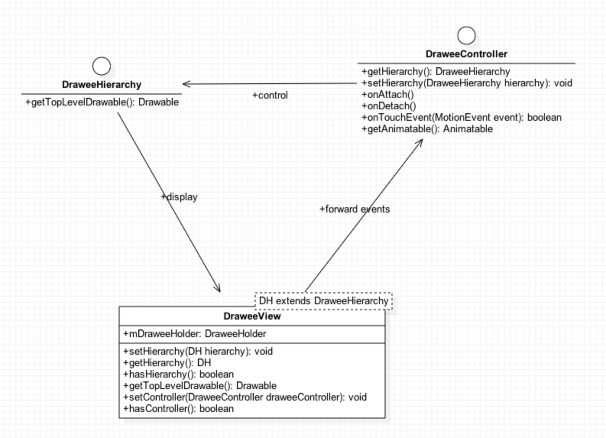

# Fresco源码解析 - Hierarachy-View-Controller

来源:[CSDN-一介码农](http://blog.csdn.net/feelang/article/details/45126421)

Fresco是一个MVC模型，由三大组件构成，它们的对应关系如下所示：

* M -> DraweeHierarchy
* V -> DraweeView
* C -> DraweeController

M 所对应的`DraweeHierarchy`是一个有层次结构的数据结构，`DraweeView`用来显示位于`DraweeHierarchy`最顶层的图像（top level drawable），`DraweeController`则用来控制`DraweeHierarchy`的顶层图像是哪一个。

```
 o FadeDrawable (top level drawable)
 |
 +--o ScaleTypeDrawable
 |  |
 |  +--o BitmapDrawable
 |
 +--o ScaleTypeDrawable
    |
    +--o BitmapDrawable
```

三者的互动关系很简单，`DraweeView`把获得的`Event`转发给`Controller`，然后`Controller`根据`Event`来决定是否需要显示和隐藏 （包括动画）图像，而这些图像都存储在`Hierarchy`中，最后`DraweeView`绘制时直接通过 `getTopLevelDrawable`就可以获取需要显示的图像。



需要注意的是，虽然现在最新的代码中，`DraweeView`还是继承自`ImageView`，但是以后会直接继承`View`，所以我们用 `DraweeView`时，尽量不要使用`ImageView`的API，例如`setImageXxx`、`setScaleType`，注释里也写得很清楚。

> Although ImageView is subclassed instead of subclassing View directly, this class does not support ImageView’s setImageXxx, setScaleType and similar methods. Extending ImageView is a short term solution in order to inherit some of its implementation (padding calculations, etc.). This class is likely to be converted to extend View directly in the future, so avoid using ImageView’s methods and properties (T5856175).

由关系图可以看出，`DraweeView`中并没有`DraweeHierarchy`和`DraweeController`类型的成员变量，而只有一个 `DrawHolder`类型的`mDrawHolder`。

```
public class DraweeHolder<DH extends DraweeHierarchy> implements VisibilityCallback {
  // other properties

  private DH mHierarchy;
  private DraweeController mController = null;

  // methods
}
```

`DraweeHolder` 存储了`mHierarchy`和`mController`，FB 为什么要这么设计呢？注释里也写得很清楚：

> Drawee users, should, as a rule, use DraweeView or its subclasses. There are situations where custom views are required, however, and this class is for those circumstances.

稍微解释一下，这是一个解耦的设计，当我们不想使用`DraweeView`，通过`ViewHolder`照样可以使用其他两个组件。比方说，自定义一个View，然后像`DraweeView`那样，在 View 中添加一个`DrawHolder`的成员变量。

再来看`DraweeView`的代码：

```
public class DraweeView<DH extends DraweeHierarchy> extends ImageView {
  // other methods and properties

  /** Sets the hierarchy. */
  public void setHierarchy(DH hierarchy) {
    mDraweeHolder.setHierarchy(hierarchy);
    super.setImageDrawable(mDraweeHolder.getTopLevelDrawable());
  }

  /** Sets the controller. */
  public void setController(@Nullable DraweeController draweeController) {
    mDraweeHolder.setController(draweeController);
    super.setImageDrawable(mDraweeHolder.getTopLevelDrawable());
  }
}
```

每次为`DraweeView`设置`hierarchy`或`controller`时，会同时通过
`super.setImageDrawable(mDraweeHolder.getTopLevelDrawable())`更新需要显示的图像。

```
/**
 * Gets the top-level drawable if hierarchy is set, null otherwise.
 */
public Drawable getTopLevelDrawable() {
  return mHierarchy == null ? null : mHierarchy.getTopLevelDrawable();
}
```

`DraweeHierarchy`只定义了一个方法 - `getTopLevelDrawable`。

```
public interface DraweeHierarchy {

  /**
   * Returns the top level drawable in the corresponding hierarchy. Hierarchy should always have
   * the same instance of its top level drawable.
   * @return top level drawable
   */
  public Drawable getTopLevelDrawable();
}
```

`DraweeController`也是一个接口，暴露了设置`hierarchy`和接收`Event`的方法。

* void setHierarchy(@Nullable DraweeHierarchy hierarchy)
* public boolean onTouchEvent(MotionEvent event)

```
/**
 * Interface that represents a Drawee controller used by a DraweeView.
 * <p> The view forwards events to the controller. The controller controls
 * its hierarchy based on those events.
 */
public interface DraweeController {

  /** Gets the hierarchy. */
  @Nullable
  public DraweeHierarchy getHierarchy();

  /** Sets a new hierarchy. */
  void setHierarchy(@Nullable DraweeHierarchy hierarchy);

  /**
   * Called when the view containing the hierarchy is attached to a window
   * (either temporarily or permanently).
   */
  public void onAttach();

  /**
   * Called when the view containing the hierarchy is detached from a window
   * (either temporarily or permanently).
   */
  public void onDetach();

  /**
   * Called when the view containing the hierarchy receives a touch event.
   * @return true if the event was handled by the controller, false otherwise
   */
  public boolean onTouchEvent(MotionEvent event);

  /**
   * For an animated image, returns an Animatable that lets clients control the animation.
   * @return animatable, or null if the image is not animated or not loaded yet
   */
  public Animatable getAnimatable();

}
```

通过以上分析可以看出，`DraweeController`、`DraweeHierarchy`、`DraweeView`三者共同构成了`Fresco`的三驾马车，下面的博文会各个击破，分析他们的实现原理和代码层次。


