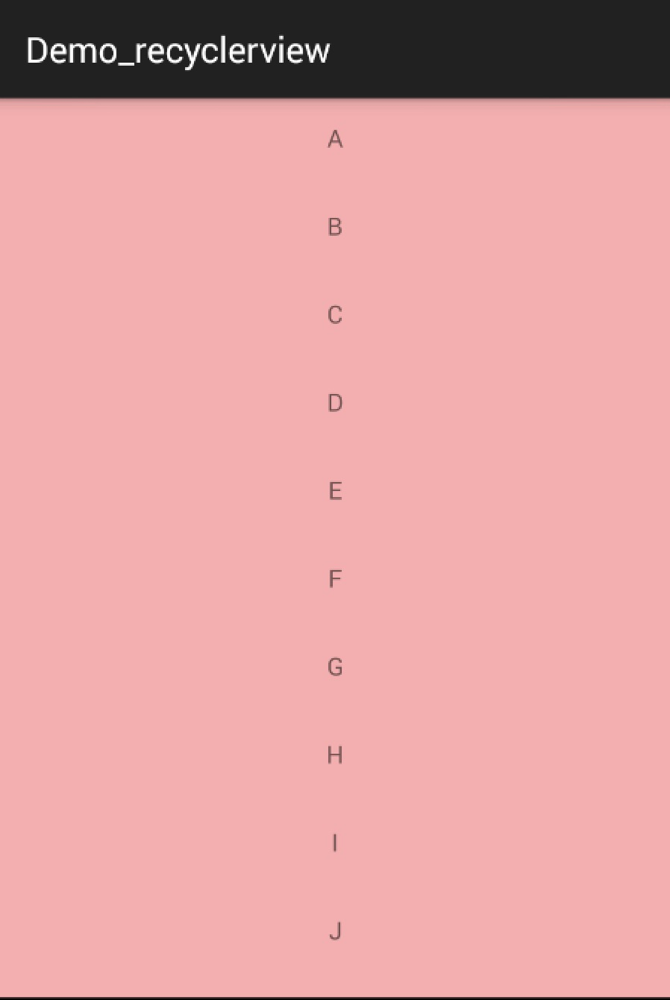
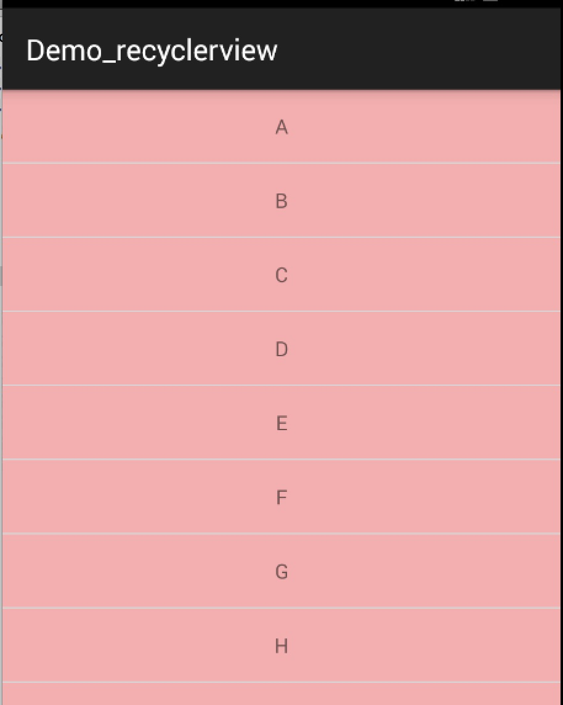
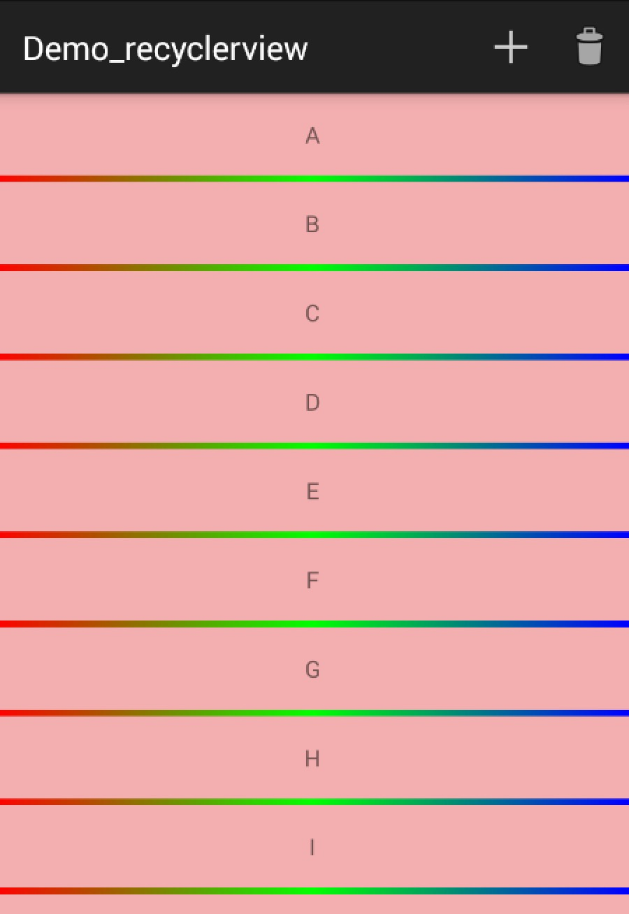
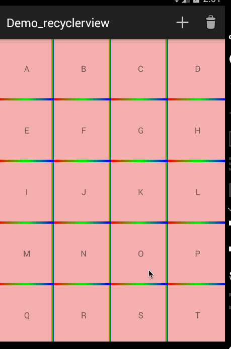
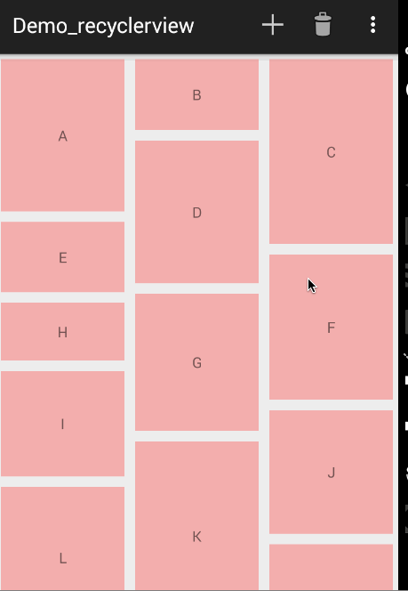
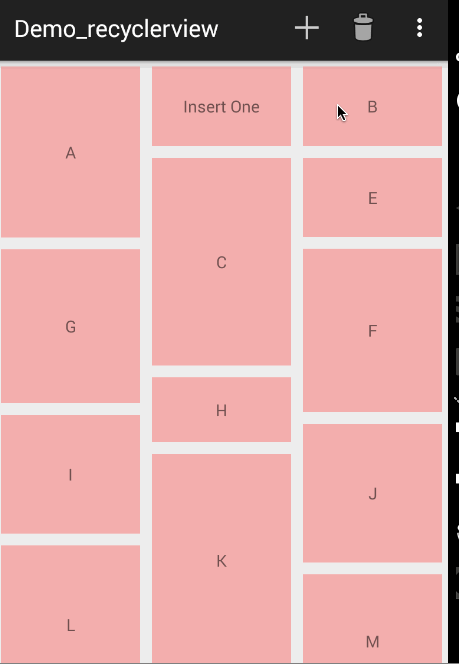
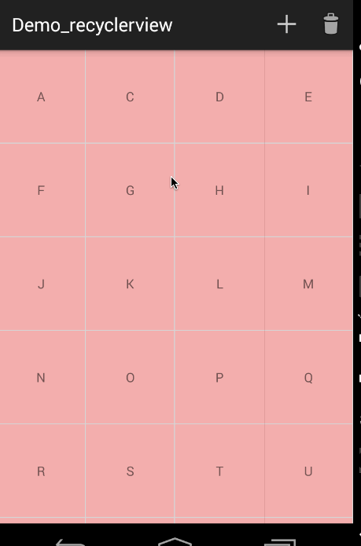
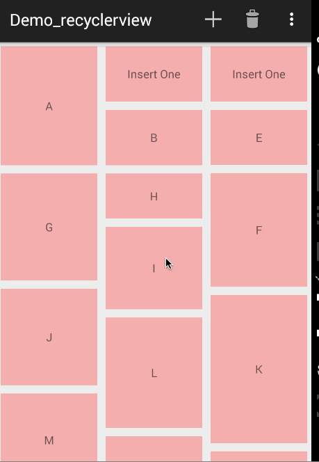

# Android RecyclerView 使用完全解析 体验艺术般的控件

来源:[CSDN](http://blog.csdn.net/lmj623565791/article/details/45059587)

## 概述

RecyclerView出现已经有一段时间了，相信大家肯定不陌生了，大家可以通过导入support-v7对其进行使用。 
据官方的介绍，该控件用于在有限的窗口中展示大量数据集，其实这样功能的控件我们并不陌生，例如：ListView、GridView。

那么有了ListView、GridView为什么还需要RecyclerView这样的控件呢？整体上看RecyclerView架构，提供了一种插拔式的体验，高度的解耦，异常的灵活，通过设置它提供的不同LayoutManager，ItemDecoration , ItemAnimator实现令人瞠目的效果。

* 你想要控制其显示的方式，请通过布局管理器LayoutManager
* 你想要控制Item间的间隔（可绘制），请通过ItemDecoration
* 你想要控制Item增删的动画，请通过ItemAnimator
* 你想要控制点击、长按事件，请自己写（擦，这点尼玛。）

## 基本使用

鉴于我们对于ListView的使用特别的熟悉，对比下RecyclerView的使用代码：

```
mRecyclerView = findView(R.id.id_recyclerview);
//设置布局管理器
mRecyclerView.setLayoutManager(layout);
//设置adapter
mRecyclerView.setAdapter(adapter)
//设置Item增加、移除动画
mRecyclerView.setItemAnimator(new DefaultItemAnimator());
//添加分割线
mRecyclerView.addItemDecoration(new DividerItemDecoration(
                getActivity(), DividerItemDecoration.HORIZONTAL_LIST));
```

ok，相比较于ListView的代码，ListView可能只需要去设置一个adapter就能正常使用了。而RecyclerView基本需要上面一系列的步骤，那么为什么会添加这么多的步骤呢？

那么就必须解释下RecyclerView的这个名字了，从它类名上看，RecyclerView代表的意义是，我只管Recycler View，也就是说RecyclerView只管回收与复用View，其他的你可以自己去设置。可以看出其高度的解耦，给予你充分的定制自由（所以你才可以轻松的通过这个控件实现ListView,GirdView，瀑布流等效果）。

## Just like ListView

* Activity

```
package com.zhy.sample.demo_recyclerview;

import java.util.ArrayList;
import java.util.List;

import android.os.Bundle;
import android.support.v7.app.ActionBarActivity;
import android.support.v7.widget.LinearLayoutManager;
import android.support.v7.widget.RecyclerView;
import android.support.v7.widget.RecyclerView.ViewHolder;
import android.view.LayoutInflater;
import android.view.View;
import android.view.ViewGroup;
import android.widget.TextView;

public class HomeActivity extends ActionBarActivity{

    private RecyclerView mRecyclerView;
    private List<String> mDatas;
    private HomeAdapter mAdapter;

    @Override
    protected void onCreate(Bundle savedInstanceState){
        super.onCreate(savedInstanceState);
        setContentView(R.layout.activity_single_recyclerview);

        initData();
        mRecyclerView = (RecyclerView) findViewById(R.id.id_recyclerview);
        mRecyclerView.setLayoutManager(new LinearLayoutManager(this));
        mRecyclerView.setAdapter(mAdapter = new HomeAdapter());

    }

    protected void initData(){
        mDatas = new ArrayList<String>();
        for (int i = 'A'; i < 'z'; i++){
            mDatas.add("" + (char) i);
        }
    }

    class HomeAdapter extends RecyclerView.Adapter<HomeAdapter.MyViewHolder>{

        @Override
        public MyViewHolder onCreateViewHolder(ViewGroup parent, int viewType){
            MyViewHolder holder = new MyViewHolder(
            LayoutInflater.from(HomeActivity.this)
            		.inflate(R.layout.item_home, parent, false));
            return holder;
        }

        @Override
        public void onBindViewHolder(MyViewHolder holder, int position){
            holder.tv.setText(mDatas.get(position));
        }

        @Override
        public int getItemCount(){
            return mDatas.size();
        }

        class MyViewHolder extends ViewHolder{

            TextView tv;

            public MyViewHolder(View view){
                super(view);
                tv = (TextView) view.findViewById(R.id.id_num);
            }
        }
    }

}
```

* Activity布局

```
<RelativeLayout xmlns:android="http://schemas.android.com/apk/res/android"
    xmlns:tools="http://schemas.android.com/tools"
    android:layout_width="match_parent"
    android:layout_height="match_parent" >

    <android.support.v7.widget.RecyclerView
        android:id="@+id/id_recyclerview"
        android:divider="#ffff0000"
        android:dividerHeight="10dp"
        android:layout_width="match_parent"
        android:layout_height="match_parent" />

</RelativeLayout>
```

* item布局文件

```
<?xml version="1.0" encoding="utf-8"?>
<FrameLayout xmlns:android="http://schemas.android.com/apk/res/android"
    android:layout_width="match_parent"
    android:background="#44ff0000"
    android:layout_height="wrap_content" >

    <TextView
        android:id="@+id/id_num"
        android:layout_width="match_parent"
        android:layout_height="50dp"
        android:gravity="center"
        android:text="1" />
</FrameLayout>
```

这么看起来用法与ListView的代码基本一致哈~~ 

看下效果图：



看起来好丑，Item间应该有个分割线，当你去找时，你会发现RecyclerView并没有支持divider这样的属性。那么怎么办，你可以给Item的布局去设置margin，当然了这种方式不够优雅，我们文章开始说了，我们可以自由的去定制它，当然我们的分割线也是可以定制的。

## temDecoration

我们可以通过该方法添加分割线： 

```
mRecyclerView.addItemDecoration() 
```

该方法的参数为RecyclerView.ItemDecoration，该类为抽象类，官方目前并没有提供默认的实现类（我觉得最好能提供几个）。 

该类的源码：

```
public static abstract class ItemDecoration {

public void onDraw(Canvas c, RecyclerView parent, State state) {
	onDraw(c, parent);
}

public void onDrawOver(Canvas c, RecyclerView parent, State state) {
	onDrawOver(c, parent);
}

public void getItemOffsets(Rect outRect, View view, RecyclerView parent, State state) {
	getItemOffsets(outRect, ((LayoutParams) view.getLayoutParams()).getViewLayoutPosition(),
                    parent);
}

@Deprecated
public void getItemOffsets(Rect outRect, int itemPosition, RecyclerView parent) {
	outRect.set(0, 0, 0, 0);
}
```

当我们调用`mRecyclerView.addItemDecoration()`方法添加decoration的时候，RecyclerView在绘制的时候，去会绘制decorator，即调用该类的onDraw和onDrawOver方法，

* onDraw方法先于drawChildren
* onDrawOver在drawChildren之后，一般我们选择复写其中一个即可。
* getItemOffsets 可以通过outRect.set()为每个Item设置一定的偏移量，主要用于绘制Decorator。

接下来我们看一个`RecyclerView.ItemDecoration`的实现类，该类很好的实现了RecyclerView添加分割线（当使用LayoutManager为LinearLayoutManager时）。 

该类参考自：[DividerItemDecoration](http://blog.csdn.net/lmj623565791/article/details/38173061)

```
package com.zhy.sample.demo_recyclerview;

/*
 * Copyright (C) 2014 The Android Open Source Project
 *
 * Licensed under the Apache License, Version 2.0 (the "License");
 * limitations under the License.
 */

import android.content.Context;
import android.content.res.TypedArray;
import android.graphics.Canvas;
import android.graphics.Rect;
import android.graphics.drawable.Drawable;
import android.support.v7.widget.LinearLayoutManager;
import android.support.v7.widget.RecyclerView;
import android.support.v7.widget.RecyclerView.State;
import android.util.Log;
import android.view.View;


/**
 * This class is from the v7 samples of the Android SDK. It's not by me!
 * <p/>
 * See the license above for details.
 */
public class DividerItemDecoration extends RecyclerView.ItemDecoration {

    private static final int[] ATTRS = new int[]{
            android.R.attr.listDivider
    };

    public static final int HORIZONTAL_LIST = LinearLayoutManager.HORIZONTAL;

    public static final int VERTICAL_LIST = LinearLayoutManager.VERTICAL;

    private Drawable mDivider;

    private int mOrientation;

    public DividerItemDecoration(Context context, int orientation) {
        final TypedArray a = context.obtainStyledAttributes(ATTRS);
        mDivider = a.getDrawable(0);
        a.recycle();
        setOrientation(orientation);
    }

    public void setOrientation(int orientation) {
        if (orientation != HORIZONTAL_LIST && orientation != VERTICAL_LIST) {
            throw new IllegalArgumentException("invalid orientation");
        }
        mOrientation = orientation;
    }

    @Override
    public void onDraw(Canvas c, RecyclerView parent) {
        Log.v("recyclerview - itemdecoration", "onDraw()");

        if (mOrientation == VERTICAL_LIST) {
            drawVertical(c, parent);
        } else {
            drawHorizontal(c, parent);
        }

    }

    public void drawVertical(Canvas c, RecyclerView parent) {
        final int left = parent.getPaddingLeft();
        final int right = parent.getWidth() - parent.getPaddingRight();

        final int childCount = parent.getChildCount();
        for (int i = 0; i < childCount; i++) {
            final View child = parent.getChildAt(i);
            RecyclerView v = new RecyclerView(parent.getContext());
            final RecyclerView.LayoutParams params = (RecyclerView.LayoutParams) child
                    .getLayoutParams();
            final int top = child.getBottom() + params.bottomMargin;
            final int bottom = top + mDivider.getIntrinsicHeight();
            mDivider.setBounds(left, top, right, bottom);
            mDivider.draw(c);
        }
    }

    public void drawHorizontal(Canvas c, RecyclerView parent) {
        final int top = parent.getPaddingTop();
        final int bottom = parent.getHeight() - parent.getPaddingBottom();

        final int childCount = parent.getChildCount();
        for (int i = 0; i < childCount; i++) {
            final View child = parent.getChildAt(i);
            final RecyclerView.LayoutParams params = (RecyclerView.LayoutParams) child
                    .getLayoutParams();
            final int left = child.getRight() + params.rightMargin;
            final int right = left + mDivider.getIntrinsicHeight();
            mDivider.setBounds(left, top, right, bottom);
            mDivider.draw(c);
        }
    }

    @Override
    public void getItemOffsets(Rect outRect, int itemPosition, RecyclerView parent) {
        if (mOrientation == VERTICAL_LIST) {
            outRect.set(0, 0, 0, mDivider.getIntrinsicHeight());
        } else {
            outRect.set(0, 0, mDivider.getIntrinsicWidth(), 0);
        }
    }
}
```

该实现类可以看到通过读取系统主题中的`android.R.attr.listDivider`作为Item间的分割线，并且支持横向和纵向。如果你不清楚它是怎么做到的读取系统的属性用于自身，请参考我的另一篇博文：[Android 深入理解Android中的自定义属性](http://blog.csdn.net/lmj623565791/article/details/38173061)

获取到listDivider以后，该属性的值是个Drawable，在`getItemOffsets`中，outRect去设置了绘制的范围。onDraw中实现了真正的绘制。

我们在原来的代码中添加一句：

```
mRecyclerView.addItemDecoration(new DividerItemDecoration(this,
DividerItemDecoration.VERTICAL_LIST));
```
ok，现在再运行，就可以看到分割线的效果了。



该分割线是系统默认的，你可以在theme.xml中找到该属性的使用情况。那么，使用系统的listDivider有什么好处呢？就是方便我们去随意的改变，该属性我们可以直接声明在：

```
<!-- Application theme. -->
<style name="AppTheme" parent="AppBaseTheme">
	<item name="android:listDivider">@drawable/divider_bg</item>  
</style>
```

然后自己写个drawable即可，下面我们换一种分隔符：

```
<?xml version="1.0" encoding="utf-8"?>
<shape xmlns:android="http://schemas.android.com/apk/res/android"
    android:shape="rectangle" >

    <gradient
        android:centerColor="#ff00ff00"
        android:endColor="#ff0000ff"
        android:startColor="#ffff0000"
        android:type="linear" />
    <size android:height="4dp"/>

</shape>
```

现在的样子是：



当然了，你可以根据自己的需求，去随意的绘制，反正是画出来的，随便玩~~

ok，看到这，你可能觉得，这玩意真尼玛麻烦，完全不能比拟的心爱的ListView。那么继续看。

## LayoutManager

好了，上面实现了类似ListView样子的Demo，通过使用其默认的LinearLayoutManager。

RecyclerView.LayoutManager吧，这是一个抽象类，好在系统提供了3个实现类：

* LinearLayoutManager 现行管理器，支持横向、纵向。
* GridLayoutManager 网格布局管理器
* StaggeredGridLayoutManager 瀑布就式布局管理器

上面我们已经初步体验了下LinearLayoutManager，接下来看GridLayoutManager。

* GridLayoutManager

我们尝试去实现类似GridView，秒秒钟的事情：

```
//mRecyclerView.setLayoutManager(new LinearLayoutManager(this));
mRecyclerView.setLayoutManager(new GridLayoutManager(this,4));
```

只需要修改LayoutManager即可，还是很nice的。

当然了，改为GridLayoutManager以后，对于分割线，前面的DividerItemDecoration就不适用了，主要是因为它在绘制的时候，比如水平线，针对每个child的取值为：

```
final int left = parent.getPaddingLeft();
final int right = parent.getWidth() - parent.getPaddingRight();
```

因为每个Item一行，这样是没问题的。而GridLayoutManager时，一行有多个childItem，这样就多次绘制了，并且GridLayoutManager时，Item如果为最后一列（则右边无间隔线）或者为最后一行（底部无分割线）。

针对上述，我们编写了DividerGridItemDecoration。

```
package com.zhy.sample.demo_recyclerview;

import android.content.Context;
import android.content.res.TypedArray;
import android.graphics.Canvas;
import android.graphics.Rect;
import android.graphics.drawable.Drawable;
import android.support.v7.widget.GridLayoutManager;
import android.support.v7.widget.RecyclerView;
import android.support.v7.widget.RecyclerView.LayoutManager;
import android.support.v7.widget.RecyclerView.State;
import android.support.v7.widget.StaggeredGridLayoutManager;
import android.view.View;

/**
 * @author zhy
 */
public class DividerGridItemDecoration extends RecyclerView.ItemDecoration {

    private static final int[] ATTRS = new int[]{android.R.attr.listDivider};
    private Drawable mDivider;

    public DividerGridItemDecoration(Context context) {
        final TypedArray a = context.obtainStyledAttributes(ATTRS);
        mDivider = a.getDrawable(0);
        a.recycle();
    }

    @Override
    public void onDraw(Canvas c, RecyclerView parent, State state) {

        drawHorizontal(c, parent);
        drawVertical(c, parent);

    }

    private int getSpanCount(RecyclerView parent) {
        // 列数
        int spanCount = -1;
        LayoutManager layoutManager = parent.getLayoutManager();
        if (layoutManager instanceof GridLayoutManager) {

            spanCount = ((GridLayoutManager) layoutManager).getSpanCount();
        } else if (layoutManager instanceof StaggeredGridLayoutManager) {
            spanCount = ((StaggeredGridLayoutManager) layoutManager)
                    .getSpanCount();
        }
        return spanCount;
    }

    public void drawHorizontal(Canvas c, RecyclerView parent) {
        int childCount = parent.getChildCount();
        for (int i = 0; i < childCount; i++) {
            final View child = parent.getChildAt(i);
            final RecyclerView.LayoutParams params = (RecyclerView.LayoutParams) child
                    .getLayoutParams();
            final int left = child.getLeft() - params.leftMargin;
            final int right = child.getRight() + params.rightMargin
                    + mDivider.getIntrinsicWidth();
            final int top = child.getBottom() + params.bottomMargin;
            final int bottom = top + mDivider.getIntrinsicHeight();
            mDivider.setBounds(left, top, right, bottom);
            mDivider.draw(c);
        }
    }

    public void drawVertical(Canvas c, RecyclerView parent) {
        final int childCount = parent.getChildCount();
        for (int i = 0; i < childCount; i++) {
            final View child = parent.getChildAt(i);

            final RecyclerView.LayoutParams params = (RecyclerView.LayoutParams) child
                    .getLayoutParams();
            final int top = child.getTop() - params.topMargin;
            final int bottom = child.getBottom() + params.bottomMargin;
            final int left = child.getRight() + params.rightMargin;
            final int right = left + mDivider.getIntrinsicWidth();

            mDivider.setBounds(left, top, right, bottom);
            mDivider.draw(c);
        }
    }

    private boolean isLastColum(RecyclerView parent, int pos, int spanCount,
                                int childCount) {
        LayoutManager layoutManager = parent.getLayoutManager();
        if (layoutManager instanceof GridLayoutManager) {
            if ((pos + 1) % spanCount == 0)// 如果是最后一列，则不需要绘制右边
            {
                return true;
            }
        } else if (layoutManager instanceof StaggeredGridLayoutManager) {
            int orientation = ((StaggeredGridLayoutManager) layoutManager)
                    .getOrientation();
            if (orientation == StaggeredGridLayoutManager.VERTICAL) {
                if ((pos + 1) % spanCount == 0) {// 如果是最后一列，则不需要绘制右边
                    return true;
                }
            } else {
                childCount = childCount - childCount % spanCount;
                if (pos >= childCount)// 如果是最后一列，则不需要绘制右边
                    return true;
            }
        }
        return false;
    }

    private boolean isLastRaw(RecyclerView parent, int pos, int spanCount,
                              int childCount) {
        LayoutManager layoutManager = parent.getLayoutManager();
        if (layoutManager instanceof GridLayoutManager) {
            childCount = childCount - childCount % spanCount;
            if (pos >= childCount)// 如果是最后一行，则不需要绘制底部
                return true;
        } else if (layoutManager instanceof StaggeredGridLayoutManager) {
            int orientation = ((StaggeredGridLayoutManager) layoutManager)
                    .getOrientation();
            // StaggeredGridLayoutManager 且纵向滚动
            if (orientation == StaggeredGridLayoutManager.VERTICAL) {
                childCount = childCount - childCount % spanCount;
                // 如果是最后一行，则不需要绘制底部
                if (pos >= childCount)
                    return true;
            } else {// StaggeredGridLayoutManager 且横向滚动
                // 如果是最后一行，则不需要绘制底部
                if ((pos + 1) % spanCount == 0) {
                    return true;
                }
            }
        }
        return false;
    }

    @Override
    public void getItemOffsets(Rect outRect, int itemPosition,
                               RecyclerView parent) {
        int spanCount = getSpanCount(parent);
        int childCount = parent.getAdapter().getItemCount();
        if (isLastRaw(parent, itemPosition, spanCount, childCount)) {// 如果是最后一行，则不需要绘制底部

            outRect.set(0, 0, mDivider.getIntrinsicWidth(), 0);
        } else if (isLastColum(parent, itemPosition, spanCount, childCount)) {// 如果是最后一列，则不需要绘制右边

            outRect.set(0, 0, 0, mDivider.getIntrinsicHeight());
        } else {
            outRect.set(0, 0, mDivider.getIntrinsicWidth(),
                    mDivider.getIntrinsicHeight());
        }
    }
}
```

主要在`getItemOffsets`方法中，去判断如果是最后一行，则不需要绘制底部；如果是最后一列，则不需要绘制右边，整个判断也考虑到了`StaggeredGridLayoutManager`的横向和纵向，所以稍稍有些复杂。最重要还是去理解，如何绘制什么的不重要。一般如果仅仅是希望有空隙，还是去设置`item的margin`方便。

最后的效果是：



ok，看到这，你可能还觉得RecyclerView不够强大？

但是如果我们有这么个需求，纵屏的时候显示为ListView，横屏的时候显示两列的GridView，我们RecyclerView可以轻松搞定，而如果使用ListView去实现还是需要点功夫的~~~

当然了，这只是皮毛，下面让你心服口服。

* StaggeredGridLayoutManager

瀑布流式的布局，其实他可以实现GridLayoutManager一样的功能，仅仅按照下列代码：

```
// mRecyclerView.setLayoutManager(new GridLayoutManager(this,4));
mRecyclerView.setLayoutManager(new StaggeredGridLayoutManager(4,
		StaggeredGridLayoutManager.VERTICAL));
```

这两种写法显示的效果是一致的，但是注意`StaggeredGridLayoutManager`构造的第二个参数传一个orientation，如果传入的是`StaggeredGridLayoutManager.VERTICAL`代表有多少列；那么传入的如果是`StaggeredGridLayoutManager.HORIZONTAL`就代表有多少行，比如本例如果改为：

```
mRecyclerView.setLayoutManager(new StaggeredGridLayoutManager(4,
        StaggeredGridLayoutManager.HORIZONTAL));
```

那么效果为：


可以看到，固定为4行，变成了左右滑动。有一点需要注意，如果是横向的时候，item的宽度需要注意去设置，毕竟横向的宽度没有约束了，应为控件可以横向滚动了。 
如果你需要一样横向滚动的GridView，那么恭喜你。

ok，接下来准备看大招，如果让你去实现个瀑布流，最起码不是那么随意就可以实现的吧？但是，如果使用RecyclerView，分分钟的事。 

那么如何实现？其实你什么都不用做，只要使用`StaggeredGridLayoutManager`我们就已经实现了，只是上面的item布局我们使用了固定的高度，下面我们仅仅在适配器的`onBindViewHolder`方法中为我们的item设置个随机的高度（代码就不贴了，最后会给出源码下载地址），看看效果图：



是不是棒棒哒，通过RecyclerView去实现ListView、GridView、瀑布流的效果基本上没有什么区别，而且可以仅仅通过设置不同的LayoutManager即可实现。

还有更nice的地方，就在于item增加、删除的动画也是可配置的。接下来看一下ItemAnimator。

## ItemAnimator

ItemAnimator也是一个抽象类，好在系统为我们提供了一种默认的实现类，期待系统多 添加些默认的实现。

借助默认的实现，当Item添加和移除的时候，添加动画效果很简单:

```
// 设置item动画
mRecyclerView.setItemAnimator(new DefaultItemAnimator());
```

系统为我们提供了一个默认的实现，我们为我们的瀑布流添加以上一行代码，效果为：



如果是GridLayoutManager呢？动画效果为：



注意，这里更新数据集不是用`adapter.notifyDataSetChanged()`而是`notifyItemInserted(position)`与`notifyItemRemoved(position) `,否则没有动画效果。 

上述为adapter中添加了两个方法：

```
public void addData(int position) {
	mDatas.add(position, "Insert One");
	notifyItemInserted(position);
}

public void removeData(int position) {
	mDatas.remove(position);
	notifyItemRemoved(position);
}
```

Activity中点击MenuItem触发：

```
@Override
public boolean onCreateOptionsMenu(Menu menu){
	getMenuInflater().inflate(R.menu.main, menu);
	return super.onCreateOptionsMenu(menu);
}

@Override
public boolean onOptionsItemSelected(MenuItem item){
	switch (item.getItemId()){
		case R.id.id_action_add:
			mAdapter.addData(1);
			break;
		case R.id.id_action_delete:
			mAdapter.removeData(1);
		break;
	}
	return true;
}
```

好了，到这我对这个控件已经不是一般的喜欢了~~~

当然了只提供了一种动画，那么我们肯定可以去自定义各种nice的动画效果。 

高兴的是，github上已经有很多类似的项目了，这里我们直接引用下：[RecyclerViewItemAnimators](https://github.com/gabrielemariotti/RecyclerViewItemAnimators)，大家自己下载查看。 

提供了`SlideInOutLeftItemAnimator`,`SlideInOutRightItemAnimator`, `SlideInOutTopItemAnimator`,`SlideInOutBottomItemAnimator`等动画效果。

## Click and LongClick

不过一个挺郁闷的地方就是，系统没有提供ClickListener和LongClickListener。 

不过我们也可以自己去添加，只是会多了些代码而已。 

实现的方式比较多，你可以通过mRecyclerView.addOnItemTouchListener去监听然后去判断手势， 
当然你也可以通过adapter中自己去提供回调，这里我们选择后者，前者的方式，大家有兴趣自己去实现。

那么代码也比较简单：

```
class HomeAdapter extends RecyclerView.Adapter<HomeAdapter.MyViewHolder>{

//...
    public interface OnItemClickLitener{
        void onItemClick(View view, int position);
        void onItemLongClick(View view , int position);
    }

    private OnItemClickLitener mOnItemClickLitener;

    public void setOnItemClickLitener(OnItemClickLitener mOnItemClickLitener){
        this.mOnItemClickLitener = mOnItemClickLitener;
    }

    @Override
    public void onBindViewHolder(final MyViewHolder holder, final int position){
        holder.tv.setText(mDatas.get(position));

        // 如果设置了回调，则设置点击事件
        if (mOnItemClickLitener != null){
            holder.itemView.setOnClickListener(new OnClickListener(){
                @Override
                public void onClick(View v){
                    int pos = holder.getLayoutPosition();
                    mOnItemClickLitener.onItemClick(holder.itemView, pos);
                }
            });

            holder.itemView.setOnLongClickListener(new OnLongClickListener(){
                @Override
                public boolean onLongClick(View v){
                    int pos = holder.getLayoutPosition();
                    mOnItemClickLitener.onItemLongClick(holder.itemView, pos);
                    return false;
                }
            });
        }
    }
//...
}
```

adapter中自己定义了个接口，然后在`onBindViewHolder`中去为`holder.itemView`去设置相应 
的监听最后回调我们设置的监听。

最后别忘了给item添加一个drawable:

```
<?xml version="1.0" encoding="utf-8"?>
<selector xmlns:android="http://schemas.android.com/apk/res/android" >
    <item android:state_pressed="true" android:drawable="@color/color_item_press"/>
    <item android:drawable="@color/color_item_normal"/>
</selector>
```

Activity中去设置监听：

```
mAdapter.setOnItemClickLitener(new OnItemClickLitener(){

	@Override
	public void onItemClick(View view, int position){
		Toast.makeText(HomeActivity.this, position + " click",
                        Toast.LENGTH_SHORT).show();
	}

	@Override
	public void onItemLongClick(View view, int position){
		Toast.makeText(HomeActivity.this, position + " long click",
                        Toast.LENGTH_SHORT).show();
		mAdapter.removeData(position);
	}
});
```

测试效果：



ok，到此我们基本介绍了RecylerView常见用法，包含了：

* 系统提供了几种LayoutManager的使用；
* 如何通过自定义ItemDecoration去设置分割线，或者一些你想作为分隔的drawable，注意这里 
* 巧妙的使用了系统的listDivider属性，你可以尝试添加使用divider和dividerHeight属性。
* 如何使用ItemAnimator为RecylerView去添加Item移除、添加的动画效果。
* 介绍了如何添加ItemClickListener与ItemLongClickListener。

可以看到RecyclerView可以实现：

* ListView的功能
GridView的功能
* 横向ListView的功能，参考[Android 自定义RecyclerView 实现真正的Gallery效果](http://blog.csdn.net/lmj623565791/article/details/38173061)
* 横向ScrollView的功
* 瀑布流效
* 便于添加Item增加和移除动

整个体验下来，感觉这种插拔式的设计太棒了，如果系统再能提供一些常用的分隔符，多添加些动画效果就更好了。

通过简单改变下LayoutManager，就可以产生不同的效果，那么我们可以根据手机屏幕的宽度去动态设置LayoutManager，屏幕宽度一般的，显示为ListView；宽度稍大的显示两列的GridView或者瀑布流（或者横纵屏幕切换时变化，有点意思~）；显示的列数和宽度成正比。甚至某些特殊屏幕，让其横向滑动~~再选择一个nice的动画效果，相信这种插件式的编码体验一定会让你迅速爱上RecyclerView。

## 参考资料

[Android 自定义RecyclerView 实现真正的Gallery效果](http://blog.csdn.net/lmj623565791/article/details/38173061)

[A First Glance at Android’s RecyclerView](https://www.grokkingandroid.com/first-glance-androids-recyclerview/)

[https://github.com/gabrielemariotti/RecyclerViewItemAnimators](https://github.com/gabrielemariotti/RecyclerViewItemAnimators)

[DividerItemDecoration](https://gist.github.com/alexfu/0f464fc3742f134ccd1e)

[源码下载](http://download.csdn.net/detail/lmj623565791/8598329)